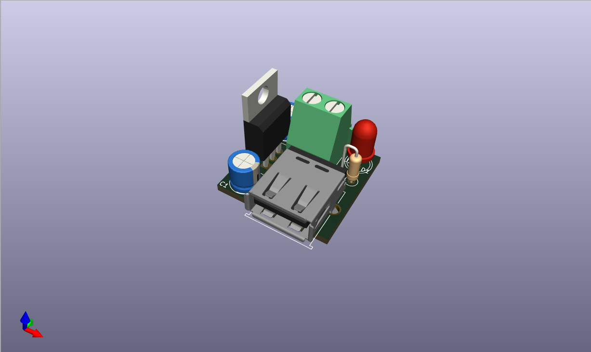

# 5V Voltage Regulator PCB Project

This project contains the design files for a 5V voltage regulator circuit implemented in both KiCad and NI Multisim.

## PCB Preview
The image above shows a 3D rendering of the PCB design, giving a clear view of component placement and board layout.

## Project Structure

- `VREG_5V.kicad_sch` - KiCad schematic file
- `VREG_5V.kicad_pcb` - KiCad PCB layout file
- `VREG_5V.kicad_pro` - KiCad project file
- `NI Multisim/VREG_5V.ms14` - NI Multisim simulation file
- `Plot/` - Generated output files and documentation
- `VREG_5V-backups/` - Automatic backup files

## Description

This project implements a 5V voltage regulator circuit, designed using KiCad for PCB layout and verified through NI Multisim simulation. The circuit provides a stable 5V DC output that can be used for various electronic applications.

## Software Used

- KiCad - For schematic capture and PCB design
- NI Multisim - For circuit simulation and verification
- FreeRouting - For PCB auto-routing (dsn file included)

## Files and Their Purpose

### KiCad Files
- `.kicad_sch` - Contains the electronic schematic
- `.kicad_pcb` - Contains the PCB layout
- `.kicad_pro` - Project settings and configuration
- `.kicad_prl` - Local project settings
- `fp-info-cache` - Footprint cache file

### Additional Files
- `freerouting.dsn` - Design file for auto-routing
- Lock files (`*.lck`) - Temporary files created when the project is open

## Documentation (Not yet)

The `Plot/` directory contains generated documentation including:
- Gerber files
- Assembly drawings
- BOM (Bill of Materials)
- PDF schematics

## Backup Information

The project maintains automatic backups in the `VREG_5V-backups/` directory for safety and version control purposes.
